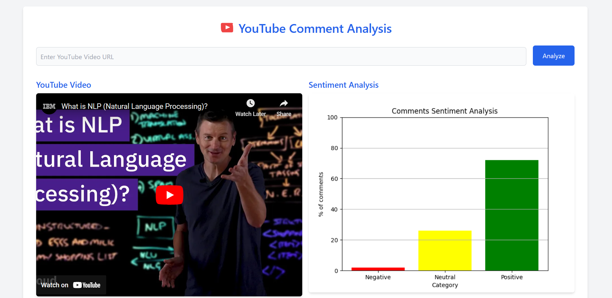

# YouTube Sentiments Analysis using NLP



## About
This project aims to analyze YouTube video comments using Natural Language Processing (NLP) and Machine Learning (ML) techniques to determine the sentiment of the comments. The application allows users to input a YouTube video link, and it scrapes the comments from the video. Then, it analyzes the comments using NLP to classify them into positive, negative, or neutral sentiments. The results are then presented to the user in the form of a graph, showing the distribution of sentiment categories in the comments.

## Features
- Scrapes YouTube comments from a specified video.
- Analyzes comments using NLP to determine sentiment.
- Presents sentiment analysis results in a graph.
- Supports adjustable volume of comments scraped per video.
- Utilizes a XGBoost ML model for sentiment analysis.

## NLP Techniques in Sentiment Analysis
Natural Language Processing (NLP) plays a crucial role in this project by enabling the analysis of textual data from YouTube comments. NLP techniques are used to preprocess the comments, extract relevant features, and train machine learning models for sentiment analysis.

In this use case, the following NLP tasks are performed:
- Text preprocessing: Cleaning the text by removing special characters, punctuation, and stopwords to prepare it for analysis.
- Tokenization: Breaking down the text into individual words or tokens to analyze each word's sentiment.
- Feature extraction: Transforming the textual data into numerical features that can be used as input to machine learning algorithms.
- Sentiment analysis: Using machine learning models to classify the sentiment of the comments into positive, negative, or neutral categories based on their features.

NLP techniques enable the system to understand the underlying sentiment of the comments and provide valuable insights into the overall feedback received by the YouTube video.

## Importing the dataset

The dataset used for training the sentiment analysis model is the "Generic Sentiment | Multidomain Sentiment Dataset". It contains 50,000 sentiments merged from multiple domains, including Yelp, Twitter, and mobile reviews.

Dataset Link: [Generic Sentiment | Multidomain Sentiment Dataset](https://www.kaggle.com/datasets/akgeni/generic-sentiment-multidomain-sentiment-dataset)

**Context**

The dataset provides sentiments from various domains. To gain a general understanding of sentiment, it covers a wide range of semantics related to sentiment analysis.

**Content**

The dataset combines mobile reviews, Twitter sentiment, Yelp reviews, toxic reviews, and more to cover multiple domains of sentiment analysis.

- 0 -> Negative
- 1 -> Neutral
- 2 -> Positive


## Usage
To use the application, follow these steps:
1. Clone the repository to your local machine.

```bash
git clone https://github.com/isMeXar/NLP-Youtube-Comments-Analysis.git
cd NLP-Youtube-Comments-Analysis
```

2. Install the required dependencies by running:

```bash
pip install -r requirements.txt
```

3. Run the Flask application by executing:

```bash
python run.py
```
4. Run the jupyter notebook to generate the model that makes the analysis. It is called 'finalized_model.sav'.
5. Access the application in your web browser and input a YouTube video link.
6. And there you have the results!

## Future Improvements
- Increase the volume of comments scraped per video for more comprehensive analysis.
- Experiment with other machine learning algorithms and fine-tune hyperparameters to improve classification accuracy.
- Enhance the user interface with additional features and visualizations for better user experience.
- Implement sentiment analysis on live streaming comments in real-time.

## Conclusion
This project demonstrates the power of NLP and machine learning in analyzing sentiment from textual data. By leveraging techniques such as text preprocessing, tokenization, and machine learning algorithms, we can gain valuable insights into the sentiments expressed in YouTube comments. With further improvements and enhancements, this project has the potential to provide even more accurate and insightful analyses of online feedback.
